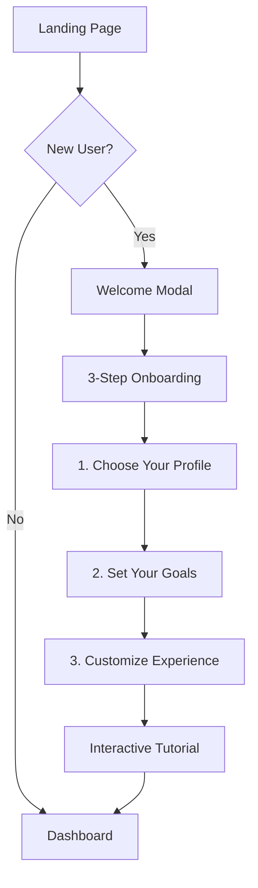
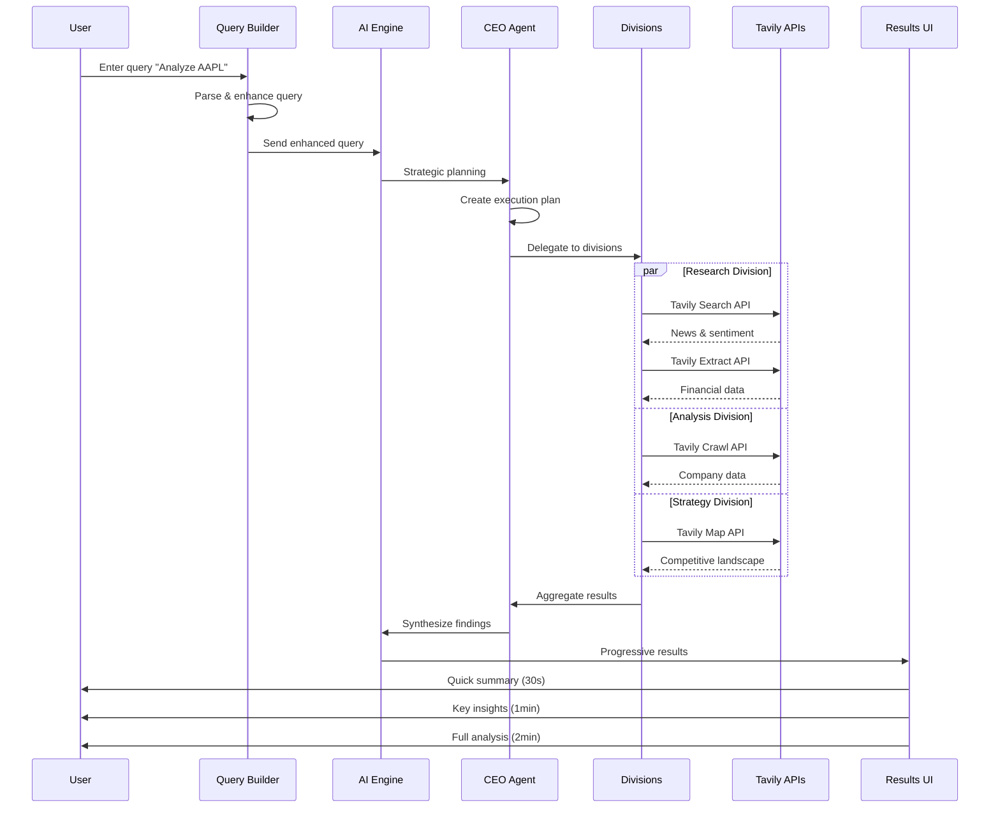

# 🎯 TavilyAI Pro - Complete UX Flow Design
## User Journey & Interaction Architecture

---

## 🚀 ONBOARDING FLOW

### **First-Time User Journey**



#### **Step 1: Profile Selection**
```typescript
interface ProfileSelector {
  profiles: [
    {
      id: 'beginner',
      title: 'New Investor',
      description: 'Just getting started with investing',
      icon: '🌱',
      features: ['Guided tutorials', 'Simple explanations', 'Safe recommendations'],
      questions: [
        'Investment experience level?',
        'Risk tolerance?',
        'Monthly budget?'
      ]
    },
    {
      id: 'trader',
      title: 'Active Trader',
      description: 'Day trading and technical analysis',
      icon: '📈',
      features: ['Real-time data', 'Advanced charts', 'Quick execution'],
      questions: [
        'Trading frequency?',
        'Preferred indicators?',
        'Position sizes?'
      ]
    },
    {
      id: 'professional',
      title: 'Professional Analyst',
      description: 'Research and portfolio management',
      icon: '💼',
      features: ['Deep research', 'Custom reports', 'API access'],
      questions: [
        'AUM size?',
        'Compliance needs?',
        'Report formats?'
      ]
    }
  ]
}
```

---

## 📊 MAIN DASHBOARD FLOW

### **Adaptive Dashboard Layout**

```
┌─────────────────────────────────────────────────────────────────────┐
│                          TOP NAVIGATION BAR                         │
│  [Logo] [SmartSearch] [Markets▼] [Watchlist★] [Alerts🔔] [Profile]  │
├─────────────────────────────────────────────────────────────────────┤
│                                                                     │
│  ┌──────────────────────────────────────────────────────────────┐  │
│  │                    INTELLIGENT QUERY BAR                     │  │
│  │  🎤 [Voice] | 🔍 "Ask me anything about stocks..."          │  │
│  │  ┌──────────────────────────────────────────────────────┐  │  │
│  │  │ Suggestions: • "Compare AAPL vs MSFT"                │  │  │
│  │  │              • "Find undervalued tech stocks"         │  │  │
│  │  │              • "Is Tesla overvalued?"                 │  │  │
│  │  └──────────────────────────────────────────────────────┘  │  │
│  └──────────────────────────────────────────────────────────────┘  │
│                                                                     │
│  ┌──────────────────────────────────────────────────────────────┐  │
│  │                    MARKET PULSE (Real-time)                  │  │
│  │  ┌────────┐ ┌────────┐ ┌────────┐ ┌────────┐ ┌────────┐   │  │
│  │  │S&P 500 │ │NASDAQ  │ │DOW     │ │BTC     │ │VIX     │   │  │
│  │  │ +1.2%  │ │ +2.1%  │ │ +0.8%  │ │ +5.2%  │ │ -3.1%  │   │  │
│  │  └────────┘ └────────┘ └────────┘ └────────┘ └────────┘   │  │
│  └──────────────────────────────────────────────────────────────┘  │
│                                                                     │
│  ┌─────────────────┬──────────────────────┬───────────────────┐   │
│  │   WATCHLIST     │   ANALYSIS CENTER    │   AI INSIGHTS     │   │
│  │  ┌──────────┐  │  ┌────────────────┐  │  ┌─────────────┐  │   │
│  │  │AAPL $182 │  │  │ Agent Progress │  │  │ Current     │  │   │
│  │  │↑ +2.3%  │  │  │ ██████▒▒▒ 60% │  │  │ Analysis    │  │   │
│  │  ├──────────┤  │  ├────────────────┤  │  │             │  │   │
│  │  │TSLA $420 │  │  │ Live Citations │  │  │ • Finding 1 │  │   │
│  │  │↓ -1.2%  │  │  │ • Reuters 2min │  │  │ • Finding 2 │  │   │
│  │  ├──────────┤  │  │ • Bloomberg 5m │  │  │ • Finding 3 │  │   │
│  │  │+ Add     │  │  └────────────────┘  │  └─────────────┘  │   │
│  │  └──────────┘  │                      │                    │   │
│  └─────────────────┴──────────────────────┴───────────────────┘   │
└─────────────────────────────────────────────────────────────────────┘
```

---

## 🔍 STOCK ANALYSIS FLOW

### **Complete Analysis Journey**



### **Progressive Results Display**

#### **Phase 1: Instant Feedback (0-5 seconds)**
```jsx
<InstantFeedback>
  <QueryUnderstanding>
    "I understand you want to analyze Apple Inc. (AAPL)"
  </QueryUnderstanding>
  <InitialData>
    <CurrentPrice>$182.59</CurrentPrice>
    <DayChange>+2.3%</DayChange>
    <Volume>52.3M</Volume>
  </InitialData>
  <AgentStatus>
    "Starting comprehensive analysis..."
  </AgentStatus>
</InstantFeedback>
```

#### **Phase 2: Quick Insights (5-30 seconds)**
```jsx
<QuickInsights>
  <KeyMetrics>
    <PE>29.5</PE>
    <MarketCap>$2.89T</MarketCap>
    <DividendYield>0.44%</DividendYield>
  </KeyMetrics>
  <AIOpinion confidence={85}>
    "Strong buy signal based on technical indicators"
  </AIOpinion>
  <TopNews>
    <Article source="Reuters" time="2min ago">
      "Apple announces record iPhone sales"
    </Article>
  </TopNews>
</QuickInsights>
```

#### **Phase 3: Deep Analysis (30s-2min)**
```jsx
<DeepAnalysis>
  <TechnicalAnalysis>
    <Chart type="candlestick" indicators={['MA', 'RSI', 'MACD']} />
    <Signals>
      <Signal type="bullish">Golden cross formation</Signal>
      <Signal type="neutral">RSI at 55</Signal>
    </Signals>
  </TechnicalAnalysis>

  <FundamentalAnalysis>
    <FinancialHealth score={92} />
    <GrowthMetrics>
      <RevenueGrowth>+8.1% YoY</RevenueGrowth>
      <EPSGrowth>+11.2% YoY</EPSGrowth>
    </GrowthMetrics>
  </FundamentalAnalysis>

  <CompetitiveAnalysis>
    <PeerComparison>
      <Competitor name="MSFT" comparison="outperforming" />
      <Competitor name="GOOGL" comparison="similar" />
    </PeerComparison>
  </CompetitiveAnalysis>
</DeepAnalysis>
```

---

## 📈 COMPARISON FLOW

### **Stock vs Stock Comparison**

```jsx
<ComparisonView>
  <HeaderSection>
    <StockCard symbol="AAPL" price="$182.59" change="+2.3%" />
    <VSIndicator animated={true} />
    <StockCard symbol="MSFT" price="$405.21" change="+1.8%" />
  </HeaderSection>

  <ComparisonMatrix>
    <MetricRow>
      <Label>P/E Ratio</Label>
      <Value winner>29.5</Value>
      <Value>32.1</Value>
    </MetricRow>
    <MetricRow>
      <Label>Revenue Growth</Label>
      <Value>+8.1%</Value>
      <Value winner>+12.3%</Value>
    </MetricRow>
    <MetricRow>
      <Label>Profit Margin</Label>
      <Value winner>25.3%</Value>
      <Value>22.1%</Value>
    </MetricRow>
  </ComparisonMatrix>

  <VisualComparisons>
    <RadarChart metrics={['Growth', 'Value', 'Quality', 'Momentum']} />
    <PerformanceChart period="1Y" />
  </VisualComparisons>

  <AIRecommendation>
    <Winner>AAPL</Winner>
    <Reasoning>
      "Better value with lower P/E and higher profit margins"
    </Reasoning>
    <Confidence>78%</Confidence>
  </AIRecommendation>
</ComparisonView>
```

---

## 📋 WATCHLIST MANAGEMENT FLOW

### **Smart Watchlist System**

```typescript
interface WatchlistFlow {
  // Multiple Lists
  lists: WatchlistType[];

  // Smart Features
  features: {
    autoGrouping: boolean;      // Group by sector/performance
    aiSuggestions: boolean;      // Suggest additions
    priceAlerts: boolean;        // Automatic alerting
    performanceTracking: boolean;
    newsMonitoring: boolean;
  };

  // Quick Actions
  actions: {
    analyze: () => void;
    compare: () => void;
    setAlert: () => void;
    share: () => void;
    export: () => void;
  };
}
```

### **Watchlist Interaction States**

```jsx
<WatchlistItem symbol="AAPL">
  {/* Default State */}
  <DefaultView>
    <Symbol>AAPL</Symbol>
    <Price>$182.59</Price>
    <Change>+2.3%</Change>
    <SparklineChart />
  </DefaultView>

  {/* Hover State */}
  <HoverView>
    <QuickStats>
      <Volume>52.3M</Volume>
      <DayRange>$180.20 - $183.40</DayRange>
    </QuickStats>
    <QuickActions>
      <Action icon="📊">Analyze</Action>
      <Action icon="🔔">Alert</Action>
      <Action icon="📈">Trade</Action>
    </QuickActions>
  </HoverView>

  {/* Expanded State */}
  <ExpandedView>
    <MiniChart period="1D" />
    <KeyMetrics />
    <LatestNews limit={3} />
    <AIInsight>
      "Unusual options activity detected"
    </AIInsight>
  </ExpandedView>
</WatchlistItem>
```

---

## 🤖 AI ASSISTANT FLOW

### **Conversational Intelligence**

```typescript
interface AIAssistantFlow {
  // Proactive Assistance
  triggers: {
    onQueryConfusion: () => "Need help? I can clarify...",
    onFirstTimeFeature: () => "Let me show you how...",
    onErrorState: () => "I can help fix this...",
    onIdleTime: () => "Would you like me to...",
  };

  // Context Awareness
  context: {
    userProfile: UserProfile;
    currentPage: string;
    recentActions: Action[];
    openPositions: Position[];
  };

  // Response Types
  responses: {
    explanation: string;        // Explain concepts
    suggestion: string[];       // Suggest actions
    tutorial: StepGuide;       // Interactive guide
    automation: () => void;    // Do it for user
  };
}
```

### **AI Interaction Examples**

```jsx
<AIAssistant>
  {/* User asks complex question */}
  <UserQuery>
    "Which tech stock has the best growth potential?"
  </UserQuery>

  <AIResponse>
    <Thinking>
      "Analyzing 50+ tech stocks based on growth metrics..."
    </Thinking>

    <ProgressSteps>
      <Step completed>Screening by revenue growth</Step>
      <Step completed>Analyzing profit margins</Step>
      <Step active>Evaluating market position</Step>
      <Step>Generating recommendations</Step>
    </ProgressSteps>

    <Results>
      <TopPick symbol="NVDA" reason="AI leadership">
        <Metrics>
          <RevenueGrowth>+122% YoY</RevenueGrowth>
          <MarketPosition>Dominant in AI chips</MarketPosition>
        </Metrics>
      </TopPick>
      <AlternativePicks>
        <Pick symbol="AMD" />
        <Pick symbol="CRWD" />
      </AlternativePicks>
    </Results>

    <FollowUp>
      <Action>Want me to analyze NVDA in detail?</Action>
      <Action>Compare these three stocks?</Action>
      <Action>Set up alerts for these?</Action>
    </FollowUp>
  </AIResponse>
</AIAssistant>
```

---

## 📊 PORTFOLIO ANALYSIS FLOW

### **Portfolio Dashboard**

```jsx
<PortfolioDashboard>
  <OverviewSection>
    <TotalValue>$125,430.50</TotalValue>
    <DayChange amount="+$2,345.20" percent="+1.91%" />
    <AllTimeReturn amount="+$25,430.50" percent="+25.4%" />
  </OverviewSection>

  <PerformanceChart>
    <TimeframePicker options={['1D', '1W', '1M', '3M', '1Y', 'ALL']} />
    <InteractiveChart
      type="area"
      showBenchmark="SP500"
      annotations={significantEvents}
    />
  </PerformanceChart>

  <Holdings>
    <TreeMap
      groupBy="sector"
      sizeBy="value"
      colorBy="performance"
    />
    <HoldingsList>
      {holdings.map(holding => (
        <HoldingCard
          symbol={holding.symbol}
          shares={holding.shares}
          value={holding.value}
          gain={holding.gain}
          allocation={holding.allocation}
        />
      ))}
    </HoldingsList>
  </Holdings>

  <RiskAnalysis>
    <RiskScore value={65} label="Moderate Risk" />
    <Diversification score={82} />
    <VolatilityChart />
    <Recommendations>
      <Suggestion>Consider adding bonds for stability</Suggestion>
      <Suggestion>Tech sector overweight at 45%</Suggestion>
    </Recommendations>
  </RiskAnalysis>
</PortfolioDashboard>
```

---

## 🔔 ALERTS & NOTIFICATIONS FLOW

### **Smart Alert System**

```typescript
interface AlertFlow {
  // Alert Types
  types: {
    price: {
      above: number;
      below: number;
      percentChange: number;
    };
    technical: {
      indicator: string;
      condition: string;
    };
    news: {
      keywords: string[];
      sentiment: 'positive' | 'negative' | 'any';
    };
    pattern: {
      type: 'breakout' | 'breakdown' | 'reversal';
    };
  };

  // Delivery Methods
  delivery: {
    inApp: boolean;
    email: boolean;
    sms: boolean;
    push: boolean;
  };

  // Alert Actions
  actions: {
    view: () => void;
    trade: () => void;
    dismiss: () => void;
    snooze: (duration: number) => void;
  };
}
```

---

## 📱 MOBILE RESPONSIVE FLOW

### **Mobile-First Interactions**

```jsx
<MobileLayout>
  {/* Bottom Navigation */}
  <BottomNav>
    <Tab icon="📊" label="Markets" />
    <Tab icon="⭐" label="Watchlist" />
    <Tab icon="🔍" label="Search" active />
    <Tab icon="💼" label="Portfolio" />
    <Tab icon="👤" label="Profile" />
  </BottomNav>

  {/* Swipe Gestures */}
  <SwipeableViews>
    <View onSwipeLeft={nextStock} onSwipeRight={prevStock}>
      <StockCard />
    </View>
  </SwipeableViews>

  {/* Voice-First Input */}
  <VoiceInput>
    <FloatingMicButton />
    <VoiceVisualizer />
    <TranscriptionDisplay />
  </VoiceInput>

  {/* Pull to Refresh */}
  <PullToRefresh onRefresh={updateData}>
    <Content />
  </PullToRefresh>
</MobileLayout>
```

---

## 🎯 ERROR STATES & RECOVERY

### **Graceful Error Handling**

```jsx
<ErrorStates>
  {/* No Data */}
  <EmptyState>
    <Illustration src="no-data.svg" />
    <Message>No stocks in your watchlist</Message>
    <Action>Add your first stock</Action>
    <Suggestions>
      <Stock>AAPL</Stock>
      <Stock>TSLA</Stock>
      <Stock>GOOGL</Stock>
    </Suggestions>
  </EmptyState>

  {/* Loading State */}
  <LoadingState>
    <SkeletonLoader />
    <ProgressMessage>
      "Analyzing 10,000+ data points..."
    </ProgressMessage>
  </LoadingState>

  {/* Error State */}
  <ErrorState>
    <ErrorIcon />
    <Message>Unable to fetch real-time data</Message>
    <Details>API rate limit exceeded</Details>
    <Actions>
      <Action>Retry</Action>
      <Action>Use cached data</Action>
    </Actions>
  </ErrorState>

  {/* Offline State */}
  <OfflineState>
    <OfflineBanner>
      "You're offline - showing cached data from 5 min ago"
    </OfflineBanner>
    <LimitedFeatures />
  </OfflineState>
</ErrorStates>
```

---

## 🚀 PERFORMANCE OPTIMIZATIONS

### **Speed & Responsiveness**

```typescript
interface PerformanceOptimizations {
  // Data Loading
  dataStrategy: {
    lazyLoading: true,           // Load as needed
    infiniteScroll: true,        // Pagination
    virtualScrolling: true,      // Large lists
    caching: 'aggressive',       // Cache everything
    prefetching: true,          // Anticipate needs
  };

  // Rendering
  rendering: {
    debounceSearch: 300,        // ms
    throttleScroll: 16,         // 60fps
    batchUpdates: true,
    progressiveEnhancement: true,
  };

  // Feedback
  feedback: {
    skeletonLoaders: true,
    optimisticUpdates: true,
    instantFeedback: true,
    loadingStates: 'granular',
  };
}
```

---

This comprehensive UX flow ensures a smooth, intuitive, and efficient user experience that minimizes cognitive load while maximizing the power of the AI-driven analysis platform.